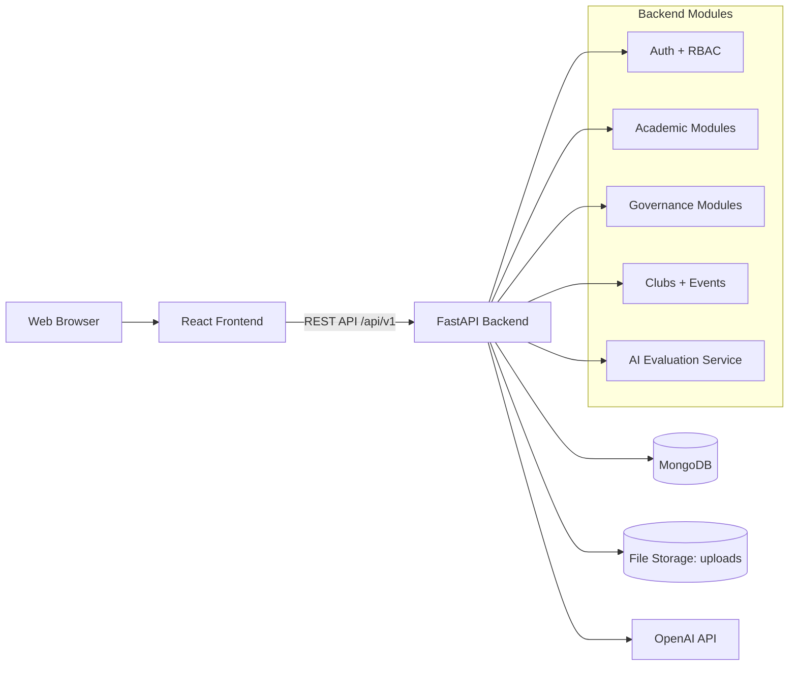
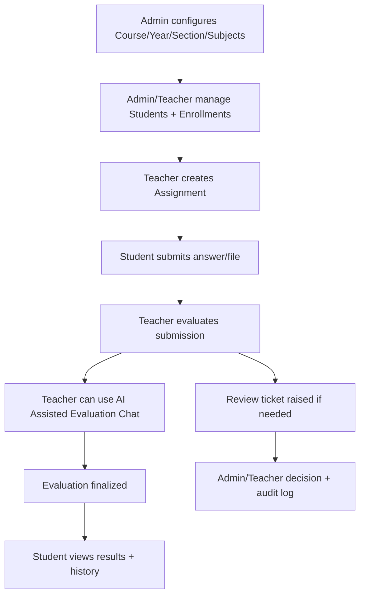

# CAPS AI - System Blueprint and Development Plan

## 1) System Overview

CAPS AI is an academic operations platform for universities, designed to manage:

- Academic structure: Course -> Year -> Section
- Users: Admin, Teacher, Student
- Teaching cycle: Subjects, Assignments, Submissions, Evaluations
- Governance: Role-scoped permissions, audit logs, review tickets
- Student life: Clubs, club events, event registrations
- AI support: AI-assisted evaluation chat for teacher workflows

Core design goals:

- Role-based access and scoped visibility
- Traceable operations through audit and history
- Modular backend APIs for each domain
- Reusable frontend entity-management patterns

---

## 2) Architecture Diagram

---

## 3) Workflow Diagram

---

## 4) Roles and Panels

### Admin Panel

- Full setup and control
- Manage users and extension roles
- Manage academic master data
- View governance/audit modules
- Can monitor cross-module activity

Key pages:

- Dashboard, Analytics
- Users
- Courses, Departments, Branches, Years, Sections
- Students, Subjects, Assignments, Enrollments
- Submissions, Evaluations, Review Tickets
- Notices, Notifications
- Clubs, Club Events, Event Registrations
- Audit Logs, Developer Panel

### Teacher Panel

- Academic execution role
- Works within permitted scopes
- Creates and evaluates assignments
- Uses AI evaluation assistant during grading
- Coordinates section/club based on assigned permissions

Key pages:

- Dashboard, Analytics
- Students, Subjects, Assignments
- Submissions, Evaluations, Review Tickets
- Enrollments (if extension role allows)
- Notices, Notifications
- Clubs, Club Events, Event Registrations
- Audit Logs (read scope)

### Student Panel

- Learning and participation role
- Submits assignments
- Views evaluations and notifications
- Registers in club events

Key pages:

- Dashboard, Analytics (student-scoped)
- Submissions
- Evaluations
- Notices, Notifications
- Clubs, Club Events, Event Registrations
- Profile, History

---

## 5) Modules List

### Identity and Access

- Authentication (login/register/change password)
- Role-based guards (admin/teacher/student)
- Extension roles:
- `year_head`
- `class_coordinator` (operationally used as section coordinator)
- `club_coordinator`
- `club_president`

### Academic Core

- Courses
- Departments
- Branches
- Years
- Sections (backed by `classes` collection for compatibility)
- Students
- Subjects
- Assignments
- Submissions
- Evaluations
- Enrollments

### Governance and Quality

- Review Tickets
- Similarity Logs
- Audit Logs
- Notices
- Notifications

### Clubs and Events

- Clubs
- Club Events
- Event Registrations

### AI and Intelligence

- AI Assisted Evaluation Chat
- Stored chat threads for auditability

---

## 6) Database Structure (MongoDB)

Primary collections:

- `users`
- `courses`
- `departments`
- `branches`
- `years`
- `classes` (logical Section entity)
- `students`
- `subjects`
- `assignments`
- `submissions`
- `evaluations`
- `enrollments`
- `review_tickets`
- `similarity_logs`
- `notices`
- `notifications`
- `clubs`
- `club_events`
- `event_registrations`
- `audit_logs`
- `ai_evaluation_chats`

### Key relationships

- `years.course_id -> courses._id`
- `classes.course_id -> courses._id`
- `classes.year_id -> years._id`
- `students.class_id -> classes._id`
- `assignments.subject_id -> subjects._id`
- `assignments.class_id -> classes._id`
- `submissions.assignment_id -> assignments._id`
- `evaluations.submission_id -> submissions._id`
- `enrollments.class_id -> classes._id`
- `enrollments.student_id -> students._id`
- `event_registrations.event_id -> club_events._id`

### AI chat structure (high-level)

- Thread scope: teacher + student + exam/assignment context
- Messages array:
- `role` (`teacher` or `ai`)
- `content`
- `timestamp`
- Metadata:
- `teacher_id`, `student_id`, `exam_id`, `question_id`
- `created_at`, `updated_at`

---

## 7) UI Flow

### Global navigation flow

- Login -> Dashboard
- Sidebar-based module access by role
- Entity pages use list/filter/create patterns

### Academic flow (Admin/Teacher)

- Open Section/Student/Subject modules
- Create assignments
- Review submissions
- Enter marks and finalize evaluations

### Student flow

- Open Submissions
- Upload assignment answer
- Track evaluation status
- Open club events and register

### Evaluation flow with AI

- Teacher opens submission evaluation screen
- Left panel: student answer + marking controls
- Right panel: AI chat assistant
- Teacher prompt -> backend -> AI response
- Conversation stored for transparency and later audit

---

## 8) Development Plan

### Phase A - Stabilization (Current Priority)

- Complete terminology migration in UI to Section
- Keep backend backward compatibility (`class_id`, `/classes`)
- Remove dead/legacy references incrementally
- Ensure clean startup + build + core tests

### Phase B - Governance Hardening

- End-to-end role smoke tests per panel
- Permission bypass testing for restricted routes
- Evaluation lock integrity checks
- Improve unauthorized visibility blocking in UI and API

### Phase C - Academic Maturity

- Strong subject-to-teacher mapping module
- Section-wise teacher assignment dashboard
- Better enrollment workflows and bulk operations
- Complete hierarchy alignment in docs and APIs

### Phase D - AI and Observability

- Expand AI evaluation capabilities (rubric scoring, consistency checks)
- Add centralized observability:
- structured logs
- request tracing
- error IDs shown in UI toast/errors

### Phase E - Quality and Release

- API contract tests for all critical routes
- UI smoke suite for role-specific navigation
- Seed scripts for realistic university datasets
- Release checklist and production readiness notes

---

## 9) Notes for Current Codebase

- User-facing terminology is moving from Class -> Section.
- Internal compatibility still uses `class_id` and `classes` collection in several modules.
- This hybrid state is intentional until full migration is completed safely.
